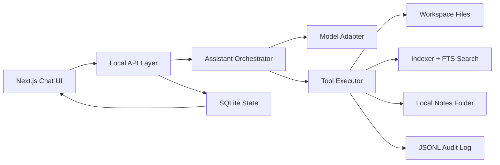

# Local AI Assistant MVP Architecture

## 1. Product Goal

This MVP is a local-first personal AI assistant that runs on a user's machine and helps with file-based productivity while keeping private data local by default.

Core value:

- privacy by default
- local model first
- file-centric workflows
- explicit user approval before risky execution

Required scope:

1. chat interface
2. local model integration
3. file read and summary
4. document search
5. session persistence
6. basic memo storage
7. user approval before execution
8. task log recording

Explicitly out of scope for MVP:

1. wake-word voice features
2. mobile apps
3. multi-messenger integrations
4. full browser automation
5. autonomous agents that act without user approval

## 2. Design Principles

1. Risky actions require explicit approval every time.
2. The default execution mode is read-only.
3. Code, models, and licenses are stored and versioned separately.
4. The product works from local repositories and local folders first.
5. Model runtime is replaceable through adapters.
6. The user can always inspect what was read, proposed, approved, and executed.

## 3. System Overview

### Recommended MVP stack

- UI and local HTTP server: Next.js App Router + TypeScript
- Persistence: SQLite for structured state, JSONL for append-only human-readable logs
- Search: SQLite FTS5 over normalized document chunks
- Local model runtime: adapter layer with one initial provider such as `ollama`, but no hard dependency in the core logic
- File access: allowlisted workspace roots only
- Note storage: Markdown files in a local notes directory plus SQLite metadata for indexing and history

### High-level architecture



### Component responsibilities

- `Next.js Chat UI`
  - session list, chat transcript, approval modal, search panel, logs panel, settings
- `Local API Layer`
  - localhost-only HTTP entrypoint for UI
  - streams assistant responses and approval events
- `Assistant Orchestrator`
  - builds prompts, decides when to call tools, classifies risk, pauses for approval
- `Model Adapter`
  - hides runtime-specific details such as model list, streaming, and token limits
- `Tool Executor`
  - runs read/search/note-save tools under a policy engine
- `Indexer + FTS Search`
  - chunks documents, normalizes metadata, serves keyword search for local docs
  - resolves the current file path from document metadata at query time so renames do not leave stale search paths
- `Local Notes Folder`
  - stores Markdown notes and exported summaries in an app-managed local directory or an approved workspace path
- `SQLite State`
  - sessions, messages, notes, approvals, tool runs, indexed documents, settings
- `JSONL Audit Log`
  - append-only execution trail for transparency and debugging

## 4. Primary User Flows

### 4.1 Chat and answer flow

1. User opens or creates a session.
2. User sends a prompt.
3. Orchestrator loads short session context plus relevant indexed documents when available.
4. Model responds directly or proposes a tool plan.
5. If the plan is read-only and inside an allowlisted workspace, the tool can run immediately.
6. If the plan can mutate files, launch a command, or leave the allowlist, the flow pauses for approval.
7. Assistant answer, tool result, and metadata are stored in the session.

### 4.2 File read and summary flow

1. User selects a workspace root once in settings.
2. UI shows files only from allowed roots.
3. Assistant uses `fs.read` or `docs.search`.
4. Content is normalized before it becomes model context.
5. UI shows source path, snippet, and timestamp so the answer remains explainable.

### 4.3 Approval-based execution flow

1. Assistant proposes an action with affected files, reason, and risk level.
2. System creates an approval request and logs it.
3. User chooses approve or reject.
4. Only approved requests can enter executor state.
5. Execution result and final status are logged and attached to the session.

### 4.4 Note draft and save flow

1. User writes a memo directly or asks the assistant to draft one from files or search results.
2. System stores the draft body and note metadata in SQLite first, even when no disk path has been chosen yet.
3. If the user wants a file saved to disk, the system records a requested relative path and prepares a `notes.save` plan with overwrite status.
4. Approval UI shows note title, requested destination path, overwrite status, and a Markdown preview.
5. At execution time the system resolves the final safe path, re-checks allowlist rules, writes the note file, and updates saved status plus the resolved path.

### 4.5 Search and indexing flow

1. Workspace scan registers documents and metadata.
2. Files are chunked into normalized text records.
3. Chunks are indexed in SQLite FTS5.
4. Search returns the current path from document metadata plus snippet, score, and chunk references.
5. Assistant uses those references when generating summaries or answers.

## 5. Proposed Folder Structure

This structure keeps the web app, domain logic, model adapters, tools, and licenses clearly separated.

```text
projectH/
  db/
    migrations/
      0001_init.sql
  apps/
    web/
      src/
        app/
          (chat)/
          api/
          notes/
          search/
          settings/
        components/
        lib/
        styles/
  packages/
    assistant-core/
      src/
        orchestrator/
        approval/
        sessions/
        logging/
    model-adapters/
      src/
        base/
        ollama/
        openai-compatible/
    tools/
      src/
        fs/
        docs/
        notes/
        approvals/
        policy/
    search/
      src/
        indexing/
        chunking/
        retrieval/
    shared/
      src/
        types/
        schemas/
        constants/
  docs/
    local-ai-assistant-mvp/
      architecture.md
      api-tools.md
      schema.sql
  config/
    app.example.toml
    model-profiles.example.toml
  licenses/
    code/
    models/
    third-party/
  runtime/
    data/
      app.db
      logs/
      cache/
  tests/
    unit/
    integration/
    e2e/
```

### Separation rules

- `apps/web`: user-facing product and local API routes
- `packages/assistant-core`: prompt orchestration and approval flow
- `packages/model-adapters`: swappable local model backends
- `packages/tools`: tool implementations and policy gates
- `runtime/data`: machine-local state, never committed
- `licenses`: explicit storage for code and model license material
- note files are stored outside the repo by default, for example `~/Documents/LocalAIAssistant/Notes`

## 6. MVP Screen Composition

### Screen 1. Session Home

Purpose:
Show recent sessions and make it obvious that all data stays local.

Key blocks:

- recent sessions list
- new session button
- selected workspace badge
- selected model badge
- local-only privacy note

### Screen 2. Chat Workspace

Purpose:
Main conversational screen for question answering, file summary, memo drafting, and approved actions.

Key blocks:

- message transcript
- prompt composer
- source references panel
- note draft side panel
- tool activity timeline
- pending approval banner

### Screen 3. Document Search

Purpose:
Search indexed local documents without needing to open chat first.

Key blocks:

- workspace selector
- keyword search box
- result list with snippet and score
- quick summarize action
- open in chat action

### Screen 4. Approval Center

Purpose:
Stop risky actions until the user explicitly confirms them.

Key blocks:

- action summary
- affected files and paths
- reason and risk level
- diff or preview when available
- approve and reject actions

### Screen 5. Notes and Logs

Purpose:
Give users one place to review saved notes and the audit trail behind them.

Key blocks:

- saved notes list
- note preview
- event stream
- filter by session, tool, or severity
- approval decisions
- execution status
- export log action

### Screen 6. Settings

Purpose:
Configure local model runtime and workspace permissions.

Key blocks:

- model provider and endpoint
- default model selection
- allowlisted workspace roots
- indexing controls
- data retention and log settings

## 7. Security Policy Draft

### 7.1 Trust boundaries

- Bind the app to `127.0.0.1` only.
- Accept requests only from same-origin local UI.
- Do not expose model endpoints or file paths to external networks.

### 7.2 File access policy

- No file access outside user-approved workspace roots.
- Default workspace mode is `read_only`.
- Write, delete, rename, shell execution, or network tools are blocked unless explicitly enabled and approved.
- `app_notes` saves accept only relative paths under the configured `notes_root`.
- `workspace_export` saves require a `workspace_id` and accept only relative paths under that workspace root.
- Every requested save path is normalized and revalidated immediately before execution.

### 7.3 Approval policy

- Reads inside an allowlisted workspace can be auto-executed.
- Note file creation, note overwrite, and summary export to disk require a fresh approval request.
- `overwrite` defaults to `false`, and any overwrite must be shown explicitly in approval UI before execution.
- Command execution or network access stays blocked in MVP.
- Approval records include actor, timestamp, payload preview, and final result.

### 7.4 Data handling

- Session history stays in local SQLite.
- Note drafts are stored in SQLite and saved notes are written as local Markdown files.
- Note sources store lightweight references such as document ID, path, snippet, and page or chunk metadata instead of copying full source content.
- Logs are written locally only.
- Raw file content is never sent to remote services in MVP mode.
- Sensitive path values should be redacted in user-facing notifications when full paths are not needed.

### 7.5 Model isolation

- Access local model runtimes through adapters, not direct UI calls.
- Keep provider credentials out of client code.
- Make model runtime replacement a config change, not a core refactor.

### 7.6 Licensing and packaging

- Keep source code licenses and model licenses in separate directories.
- Store runtime model metadata in config, not hard-coded in product logic.
- Do not bundle third-party model weights into app source by default.

## 8. Implementation Priority

### Phase 0. Foundation

Goal:
Create a bootable local web app skeleton and the core storage contract.

Tasks:

1. Initialize `pnpm` workspace and Next.js app.
2. Add SQLite access layer and migration runner.
3. Add local config loader for workspace roots and model profiles.
4. Implement JSONL audit logger.

### Phase 1. Chat and local model

Goal:
Deliver a minimal usable assistant without file mutation.

Tasks:

1. Build session list and chat workspace UI.
2. Add model adapter interface and first local provider implementation.
3. Implement streaming chat responses.
4. Save sessions and messages in SQLite.

### Phase 2. File read and document search

Goal:
Make the assistant useful for local knowledge work and note capture.

Tasks:

1. Add workspace allowlist management.
2. Implement file listing and file read tools.
3. Build chunking and FTS indexing pipeline.
4. Add document search screen and chat citations.
5. Add summarize-from-file and summarize-from-search flows.
6. Add note drafts backed by SQLite plus a local notes list UI.

### Phase 3. Approval engine and controlled execution

Goal:
Introduce safe automation without autonomous behavior.

Tasks:

1. Add tool risk classification and approval request state machine.
2. Build approval center UI and event streaming.
3. Add `notes.save` for Markdown note creation and overwrite with preview.
4. Log approval decisions and execution outcomes.

### Phase 4. Hardening

Goal:
Make the MVP testable, explainable, and easy to extend.

Tasks:

1. Add unit tests for policy, tool routing, and search ranking.
2. Add integration tests for session persistence and approval flow.
3. Add export and retention controls for logs.
4. Add adapter contract tests so future local models can be swapped safely.

## 9. Recommended MVP Decisions

If we want the fastest path with low architectural regret, the defaults should be:

- Next.js web UI on localhost
- SQLite + FTS5 for all local state and search
- `ollama` as the first adapter, behind a generic `ModelAdapter` interface
- read-only tools first, with `notes.save` as the first approved write tool
- append-only JSONL logs mirrored from structured DB events
- a default notes directory such as `~/Documents/LocalAIAssistant/Notes`

This keeps the MVP private, inspectable, and easy to evolve into a stronger local assistant without committing to one model vendor or one execution style.
