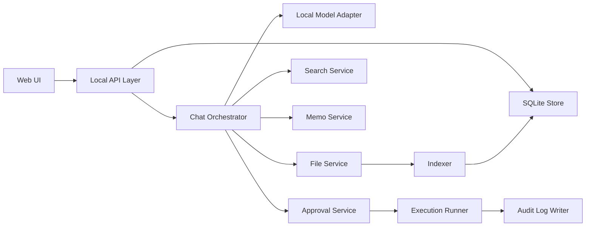

# 로컬 AI 비서 MVP 기획 문서

## 1. 문서 목적

이 문서는 개인용 로컬 AI 비서 MVP의 제품 범위, 우선순위, 사용자 흐름, 비기능 요구사항, 화면 구성, 시스템 모듈, 리스크, 확장 방향을 구현 가능한 수준으로 정리한 기준 문서다.

이 문서의 판단 기준은 다음 세 가지다.

1. 사용자 데이터가 외부로 나가지 않아야 한다.
2. 문서 작업 생산성이 실제로 개선되어야 한다.
3. 자동 실행은 항상 사용자 승인 아래에서만 허용되어야 한다.

## 2. 제품 한 줄 정의

내 PC 안에서만 동작하며, 로컬 문서를 읽고 찾고 요약하고 메모로 남겨 주되, 파일 쓰기 같은 실행은 반드시 사용자 승인 후에만 수행하는 개인용 AI 비서.

## 3. 대상 사용자와 해결하려는 문제

### 대상 사용자

- 문서 작성, 정리, 검색이 많은 개인 사용자
- 업무 자료를 외부 SaaS에 업로드하기 꺼리는 사용자
- 폴더와 파일 중심으로 정보를 관리하는 사용자

### 핵심 문제

- 필요한 문서를 빠르게 찾기 어렵다.
- 문서를 읽고 핵심을 정리하는 데 시간이 많이 든다.
- 메모와 원문 문서가 분리되어 흐름이 끊긴다.
- AI 도구를 쓰고 싶지만 데이터 외부 전송과 과도한 자동화가 불안하다.

## 4. MVP 범위 정의

### 포함 범위

- 로컬 웹 UI 기반 채팅 인터페이스
- 로컬 모델 1종 우선 연결
- 허용된 로컬 폴더 내 파일 읽기
- 문서 요약
- 문서 검색
- 세션 저장과 이어보기
- 기본 메모 저장
- 승인 기반 작업 실행
- 작업 로그 기록

### 제외 범위

- 음성 웨이크워드
- 모바일 앱
- 다중 메신저 연동
- 브라우저 완전 자동조작
- 자율 실행형 에이전트
- 대규모 독자 모델 학습

### MVP 범위 고정 규칙

- 기본 동작은 읽기 전용이다.
- 승인 기반 실행은 MVP에서 `메모 저장`, `요약본 저장`, `기존 메모 덮어쓰기`에 한정한다.
- 명령 실행, 브라우저 조작, 외부 네트워크 호출은 MVP에 포함하지 않는다.
- 지원 문서 형식은 우선 `txt`, `md`, `pdf`로 제한한다.

## 5. 기능 우선순위 표

우선순위는 출시 제외 여부가 아니라 구현 순서 기준이다. MVP 출시 전에는 `P0`부터 `P2`까지 모두 완료한다.

| 우선순위 | 기능 | 사용자 가치 | 구현 범위 | 완료 기준 |
| --- | --- | --- | --- | --- |
| `P0` | 채팅 인터페이스 | 모든 사용 흐름의 진입점 | 세션 목록, 새 대화, 메시지 송수신, 스트리밍 응답 | 사용자가 새 세션을 만들고 질문을 보내고 답변을 볼 수 있다 |
| `P0` | 로컬 모델 연결 | 외부 전송 없는 AI 응답 | 로컬 모델 어댑터 1종, 모델 상태 확인, 모델 선택 | 모델 연결 실패 시 원인이 보이고, 연결 시 응답이 정상 스트리밍된다 |
| `P0` | 파일 읽기 | 문서 기반 답변의 출발점 | 허용 폴더 내 파일 목록, 단일 파일 읽기, 텍스트 추출 | 지정 파일을 읽어 답변 근거로 사용할 수 있다 |
| `P0` | 세션 저장 | 작업 맥락 유지 | SQLite 기반 세션/메시지 저장, 최근 세션 목록 | 앱 재시작 후 기존 대화가 복원된다 |
| `P1` | 문서 요약 | 읽기 시간 단축 | 단일 문서 요약, 검색 결과 기반 요약, 요약 근거 표시 | 사용자가 문서 요약을 요청하면 핵심 요점과 출처가 함께 표시된다 |
| `P1` | 문서 검색 | 필요한 자료 재발견 | 문서 인덱싱, 키워드 검색, 결과 스니펫 | 사용자가 키워드로 문서를 찾고 결과에서 바로 채팅으로 이어갈 수 있다 |
| `P1` | 기본 메모 저장 | 결과를 파일로 남기기 | Markdown 메모 저장, 메모 제목/본문/생성시각 저장 | 사용자가 직접 작성한 메모와 AI 생성 메모를 로컬 파일로 저장할 수 있다 |
| `P2` | 승인 기반 작업 실행 | 안전한 자동화 | 실행 계획 미리보기, 승인/거절, 승인 후 파일 쓰기 | 파일 저장/덮어쓰기 전 승인 요청이 나타나고 승인 시에만 실행된다 |
| `P2` | 작업 로그 기록 | 투명성 및 추적성 | 승인 요청, 승인 결과, 도구 실행 결과, 오류 로그 | 사용자가 어떤 작업이 언제 실행됐는지 로그 화면에서 확인할 수 있다 |

### 기능별 구현 메모

- 첫 번째 로컬 모델 제공자는 `Ollama`를 기본 가정으로 한다.
- 메모 저장 형식은 호환성과 이식성을 위해 `Markdown`을 기본으로 한다.
- 메모 기본 저장 위치는 `~/Documents/LocalAIAssistant/Notes`로 두고, 이후 워크스페이스 내 저장으로 확장 가능하게 설계한다.

## 6. 사용자 시나리오 3개

### 시나리오 1. 긴 문서를 빠르게 요약하고 핵심만 확인한다

상황:
사용자는 로컬 폴더에 저장된 회의록이나 초안 문서를 짧게 파악하고 싶다.

흐름:

1. 사용자가 채팅 화면에서 워크스페이스를 선택한다.
2. 사용자가 특정 파일을 선택하거나 파일 경로를 지정한다.
3. 시스템이 파일을 읽고 텍스트를 추출한다.
4. 로컬 모델이 핵심 요약, 주요 항목, 후속 액션을 생성한다.
5. UI는 요약과 함께 원문 파일 경로와 참조 구간을 보여 준다.

성공 기준:

- 1개 문서를 선택해 1번 요청으로 요약을 얻을 수 있다.
- 답변에 최소 1개 이상의 출처 정보가 붙는다.
- 모델이 실패하면 파일 읽기 성공 여부와 모델 실패 원인이 분리되어 보인다.

### 시나리오 2. 검색 결과를 바탕으로 메모를 만들고 승인 후 저장한다

상황:
사용자는 여러 문서를 찾아본 뒤 핵심만 묶어 개인 메모로 저장하고 싶다.

흐름:

1. 사용자가 검색 화면에서 키워드를 입력한다.
2. 시스템이 인덱스된 문서에서 결과 목록과 스니펫을 보여 준다.
3. 사용자가 결과 일부를 선택해 "메모로 정리"를 요청한다.
4. 로컬 모델이 선택 문서를 바탕으로 메모 초안을 생성한다.
5. 시스템이 저장 위치와 파일명을 포함한 저장 계획을 보여 준다.
6. 사용자가 승인하면 메모가 Markdown 파일로 저장된다.
7. 저장 결과가 채팅과 로그 화면에 기록된다.

성공 기준:

- 검색 결과에서 바로 메모 초안을 만들 수 있다.
- 파일 쓰기 전에 반드시 승인 UI가 노출된다.
- 저장 후 생성 파일 경로와 저장 시각을 확인할 수 있다.

### 시나리오 3. 이전 대화를 다시 열어 중단한 작업을 이어간다

상황:
사용자는 어제 정리하던 자료를 오늘 다시 이어서 보고 싶다.

흐름:

1. 사용자가 홈 화면에서 최근 세션을 선택한다.
2. 시스템이 이전 대화, 사용한 문서, 마지막 작업 로그를 불러온다.
3. 사용자가 "어제 요약한 문서의 핵심 차이만 다시 정리해 줘"처럼 후속 질문을 입력한다.
4. 시스템이 세션 문맥과 검색 결과를 함께 사용해 답변한다.

성공 기준:

- 세션 재진입 시 이전 대화가 순서대로 복원된다.
- 이전에 읽은 문서 경로와 저장한 메모 이력이 확인된다.
- 사용자는 처음부터 다시 설명하지 않고 후속 질문을 이어갈 수 있다.

## 7. 비기능 요구사항

| 구분 | 요구사항 | 목표 수준 |
| --- | --- | --- |
| 프라이버시 | 사용자 문서, 세션, 로그는 기본적으로 로컬 머신 밖으로 전송하지 않는다 | 외부 전송 금지, 단 로컬 모델 엔드포인트 통신만 허용 |
| 보안 | 앱은 로컬에서만 접근 가능해야 한다 | `127.0.0.1` 바인딩, same-origin 요청만 허용 |
| 접근 통제 | 허용된 폴더 외 파일 접근을 차단해야 한다 | 워크스페이스 allowlist 기반, 기본 `read_only` |
| 승인 정책 | 파일 쓰기와 덮어쓰기는 항상 사용자 승인 후 실행한다 | 승인 없는 쓰기 금지 |
| 성능 | 문서 작업 체감 속도가 실사용 가능한 수준이어야 한다 | 채팅 첫 응답 시작 5초 이내, 검색 결과 반환 1초 이내 목표 |
| 안정성 | 앱 재시작 후 이전 작업을 이어볼 수 있어야 한다 | 세션/메모/로그 영속 저장 |
| 설명 가능성 | 답변과 작업 결과를 추적할 수 있어야 한다 | 출처 문서 경로, 승인 기록, 작업 로그 제공 |
| 확장성 | 모델이나 도구를 교체해도 코어를 크게 바꾸지 않아야 한다 | 모델 어댑터, 도구 레지스트리, 정책 모듈 분리 |
| 장애 대응 | 모델 미기동, 파일 파싱 실패, 인덱스 누락 시 UI가 이유를 보여 줘야 한다 | 사용자 친화적 오류 메시지와 재시도 경로 제공 |
| 단일 사용자 전제 | MVP는 개인 PC 1인 사용을 기준으로 한다 | 다중 계정, 권한 역할, 서버 동기화는 제외 |

### 운영 제약

- 로그는 구조화된 DB 이벤트와 JSONL 파일로 이중 기록한다.
- 색인 대상 파일 수가 많더라도 UI는 비동기 인덱싱 상태를 보여 줘야 한다.
- 파일 파싱 실패는 전체 세션 실패로 번지지 않아야 한다.

## 8. 화면 구성 초안

### 화면 1. 홈 및 세션 목록

목적:
최근 작업을 다시 열고 새 세션을 시작한다.

구성 요소:

- 최근 세션 목록
- 새 대화 시작 버튼
- 현재 로컬 모델 상태 배지
- 선택된 워크스페이스 표시
- 최근 로그 요약 3건

### 화면 2. 채팅 작업 화면

목적:
문서 질문, 요약 요청, 메모 생성 요청을 수행한다.

구성 요소:

- 좌측 세션 리스트
- 중앙 대화 타임라인
- 하단 입력창과 첨부 파일 선택
- 우측 출처 패널
- 상단 현재 모델/워크스페이스 상태 표시

### 화면 3. 문서 검색 화면

목적:
로컬 문서를 검색하고 결과를 채팅 또는 메모 작성으로 연결한다.

구성 요소:

- 검색 입력창
- 필터: 파일 형식, 워크스페이스, 최근 수정일
- 검색 결과 목록
- 스니펫 미리보기
- "채팅으로 보내기", "메모로 정리" 액션

### 화면 4. 승인 대기 화면 또는 모달

목적:
쓰기 작업이 발생하기 전에 사용자가 명시적으로 승인한다.

구성 요소:

- 작업 종류
- 저장 위치와 파일명
- 새 파일 생성 또는 덮어쓰기 여부
- 생성될 메모 미리보기
- 승인 / 거절 버튼

### 화면 5. 메모 및 로그 화면

목적:
저장된 메모와 작업 이력을 확인한다.

구성 요소:

- 메모 목록
- 메모 상세 보기
- 승인 기록 목록
- 작업 로그 타임라인
- 오류 필터

## 9. 시스템 모듈 구조

### 모듈별 책임

| 모듈 | 책임 | 입력 | 출력 |
| --- | --- | --- | --- |
| `Web UI` | 채팅, 검색, 승인, 로그 조회 화면 제공 | 사용자 입력, 세션 선택 | API 요청, 스트리밍 렌더링 |
| `Local API Layer` | 로컬 UI와 내부 서비스 연결 | HTTP 요청 | JSON 응답, 스트리밍 이벤트 |
| `Chat Orchestrator` | 대화 문맥 구성, 도구 호출 결정, 응답 생성 | 메시지, 세션 상태, 검색 결과 | 모델 입력, 도구 계획, 최종 응답 |
| `Local Model Adapter` | 로컬 모델 연결 추상화 | 프롬프트, 옵션 | 스트리밍 텍스트, 오류 |
| `File Service` | 허용 폴더 검사, 파일 읽기, 파일 메타데이터 수집 | 워크스페이스, 경로 | 텍스트 내용, 파일 정보 |
| `Search Service` | 문서 검색 질의 처리 | 검색어, 워크스페이스 | 결과 목록, 스니펫 |
| `Indexer` | 문서 추출, 청킹, 색인 갱신 | 파일 변경 이벤트, 수동 색인 요청 | 검색 인덱스 레코드 |
| `Memo Service` | 메모 초안 저장, 메모 파일 관리 | 제목, 본문, 저장 위치 | 메모 메타데이터, 저장 결과 |
| `Approval Service` | 승인 요청 생성, 상태 변경 | 실행 계획 | 승인 요청, 승인 결과 |
| `Execution Runner` | 승인된 쓰기 작업 실행 | 승인 완료 작업 | 실행 결과 |
| `SQLite Store` | 세션, 메시지, 메모, 승인, 로그 영속화 | 서비스 이벤트 | 저장된 데이터 |
| `Audit Log Writer` | 사람과 시스템이 읽을 수 있는 실행 기록 남김 | 승인/실행 이벤트 | JSONL 로그, DB 로그 |

### 권장 구현 경계

- `Web UI`는 파일 시스템에 직접 접근하지 않는다.
- 모델 연결은 `Local Model Adapter`를 통해서만 수행한다.
- 파일 쓰기는 `Execution Runner`만 수행하며, 그 전에 `Approval Service`를 반드시 거친다.
- 로그는 모든 쓰기 작업과 승인 이벤트에 대해 누락 없이 기록한다.

## 10. 리스크 목록

| 리스크 | 설명 | 영향도 | 대응 방안 |
| --- | --- | --- | --- |
| 로컬 모델 성능 편차 | 사용자 PC 사양에 따라 응답 속도가 크게 다를 수 있다 | 높음 | 첫 제공 모델을 1종으로 제한하고, 모델 상태와 예상 응답 지연을 UI에 표시 |
| 문서 파싱 한계 | PDF 텍스트 추출 품질이 일정하지 않을 수 있다 | 중간 | 지원 형식을 `txt`, `md`, `pdf`로 제한하고, 파싱 실패 원인을 노출 |
| 승인 피로도 | 저장 작업이 너무 자주 승인 요구를 만들면 사용자 경험이 나빠진다 | 중간 | MVP에서 승인 대상은 쓰기 작업만으로 제한하고, 읽기 작업은 자동 허용 |
| 파일 접근 보안 | 경로 조작이나 심볼릭 링크로 허용 폴더 밖 접근이 시도될 수 있다 | 높음 | 실경로 정규화, allowlist 검사, 경로 traversal 차단 |
| 인덱스 불일치 | 원문 파일이 바뀌었는데 검색 인덱스가 오래될 수 있다 | 중간 | 수동 재색인 버튼과 마지막 색인 시각 표시 |
| 로그 민감도 | 로그에 원문 내용이 과도하게 남으면 프라이버시 위험이 생긴다 | 높음 | 로그에는 경로, 작업 타입, 상태 중심으로 기록하고 원문 전체는 저장하지 않음 |
| 기능 범위 팽창 | 자동화 기대가 커지면서 브라우저 조작이나 명령 실행 요구가 빨리 들어올 수 있다 | 중간 | MVP 승인 실행 범위를 문서 저장으로 제한하고, 범위 밖 기능은 별도 단계로 분리 |

## 11. 향후 확장 방향

### 11.1 단기 확장

- `docx` 등 추가 문서 형식 지원
- 메모 템플릿과 요약 스타일 프리셋 추가
- 세션 내 여러 문서 비교 요약
- 메모를 다시 검색 결과에 포함하는 개인 지식 베이스화

### 11.2 중기 확장

- `llama.cpp` 등 추가 로컬 모델 런타임 지원
- 키워드 검색 + 임베딩 검색의 하이브리드 검색
- 승인 기반 배치 작업
  - 예: 선택 문서 여러 개를 순차 요약해 메모 폴더에 저장
- 폴더별 정책
  - 예: 어떤 폴더는 읽기만 허용, 어떤 폴더는 승인 후 저장 허용

### 11.3 장기 확장

- 부분 자동화 도구 확장
  - 예: 로컬 앱 열기, 파일 이동, 캘린더 초안 작성
- 개인 지식 관리 기능 강화
  - 예: 메모 간 링크, 주제별 묶음, 회고 자동 정리
- 독자 모델 교체 지원 고도화
  - 모델별 프롬프트 정책과 성능 프로파일 관리

## 12. 출시 판단 기준

다음 조건을 모두 만족하면 MVP 출시 가능 상태로 본다.

1. 사용자가 로컬 모델과 연결된 채팅에서 문서를 읽고 요약할 수 있다.
2. 사용자가 검색 결과를 바탕으로 메모를 만들고 승인 후 저장할 수 있다.
3. 앱을 재시작해도 세션, 메모, 로그가 유지된다.
4. 승인 없는 파일 쓰기가 기술적으로 불가능하다.
5. 오류가 나더라도 사용자에게 원인과 다음 행동이 보인다.

## 13. 관련 문서

- 기술 아키텍처: [architecture.md](/home/xpdlqj/code/projectH/docs/local-ai-assistant-mvp/architecture.md)
- API 및 도구 계약 초안: [api-tools.md](/home/xpdlqj/code/projectH/docs/local-ai-assistant-mvp/api-tools.md)
- SQLite 스키마 초안: [schema.sql](/home/xpdlqj/code/projectH/docs/local-ai-assistant-mvp/schema.sql)
